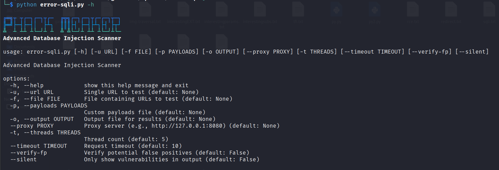

# Advanced Database Injection Scanner (ADIS)

<p align="center"></p> <!-- Consider adding a banner image -->

A powerful multi-threaded scanner for detecting SQL and NoSQL injection vulnerabilities with advanced WAF bypass techniques and comprehensive reporting.

## Features

- **Multi-Database Support**: Detects vulnerabilities in 9 database systems
- **Advanced Payloads**: 100+ carefully crafted injection payloads
- **WAF Bypass**: Built-in techniques to bypass common web application firewalls
- **Smart Detection**: Error-based, boolean-based, and time-based detection
- **False Positive Checks**: Optional verification to reduce false positives
- **Multi-Threaded**: Fast scanning with configurable thread count
- **Comprehensive Reporting**: Detailed vulnerability reports with exploit URLs
- **Flexible Input**: Scan single URLs or files containing multiple targets

## Supported Databases

| Database            | Detection Methods           |
|---------------------|-----------------------------|
| MySQL               | Error, Boolean, Time        |
| PostgreSQL          | Error, Boolean              |
| Microsoft SQL Server| Error, Boolean              |
| Oracle              | Error                       |
| MongoDB             | NoSQL injection             |
| Redis               | Command injection           |
| Cassandra           | CQL injection               |
| CouchDB             | JSON injection              |
| ElasticSearch       | Query DSL injection         |

## Installation 

```bash
git clone https://github.com/XploitPoy-777/Error-Sqli.git
cd Error-Sqli
pip install -r requirements.txt
```

## Usage

```bash
python adis.py -u http://example.com/vuln.php?id=1

# Basic Scanning
# Scan single URL
python error-sqli.py -u http://example.com/page.php?id=1

# Scan multiple URLs from file
python error-sqli.py -f urls.txt

# Use 20 threads for faster scanning
python error-sqli.py -f urls.txt -t 20
```
## Advanced Options

```bash
# Use custom payloads file
python error-sqli.py -u http://example.com -p custom_payloads.txt

# Enable false positive verification
python error-sqli.py -u http://example.com --verify-fp

# Save results to file
python error-sqli.py -u http://example.com -o results.txt

# Use proxy (e.g., Burp Suite)
python error-sqli.py -u http://example.com --proxy http://127.0.0.1:8080

# Silent mode (only show vulnerabilities)
python error-sqli.py -u http://example.com --silent
```

## Payload Customization
```bash
' OR 1=1--
" OR 1=1--
' UNION SELECT null,null--
{"$ne": 1}
```
## Output Example
```bash
[+] VULNERABLE: http://testphp.vulnweb.com/artists.php?artist=1
    Parameter: artist
    Payload: '
    Database: MySQL
    Error: SQL syntax; check the manual that corresponds to your MySQL
    Exploit URL: http://testphp.vulnweb.com/artists.php?artist=%27
```

## Best Practices
- Legal Compliance: Only scan systems you own or have permission to test

- Rate Limiting: Use -t 5 (or lower) for production systems

- Verification: Always use --verify-fp for critical assessments

- Reporting: Save results with -o for documentation

- Proxy: Route through Burp Suite (--proxy) for debugging
